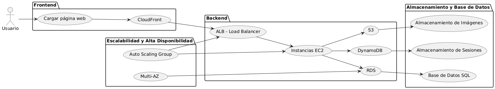

# Solución de problemas comunes en AWS

## Sección 1: Preguntas teóricas

### ¿Cuál es la diferencia entre una instancia EC2 con almacenamiento EBS y una con almacenamiento efímero?
- **EBS (Elastic Block Store)**: Es un almacenamiento persistente que permanece disponible incluso después de detener o terminar la instancia EC2. Se utiliza para guardar datos importantes y a largo plazo.
  - **Caso de uso**: Bases de datos, sistemas de archivos y almacenamiento de aplicaciones.
- **Almacenamiento efímero (Instance Store)**: Es almacenamiento temporal que se pierde cuando la instancia EC2 se detiene, se reinicia o se termina. Ofrece un rendimiento más rápido que EBS.
  - **Caso de uso**: Almacenamiento temporal para datos que pueden reconstruirse, como cachés o datos intermedios.

### Explica los niveles de almacenamiento de S3 y un caso de uso para cada uno.
1. **S3 Standard**:
   - Almacenamiento de alta durabilidad y baja latencia para datos a los que se accede frecuentemente.
   - **Caso de uso**: Sitios web, aplicaciones móviles y archivos dinámicos.
2. **S3 Standard-IA (Infrequent Access)**:
   - Almacenamiento para datos a los que se accede menos frecuentemente pero que necesitan estar disponibles de inmediato.
   - **Caso de uso**: Copias de seguridad y recuperación de desastres.
3. **S3 One Zone-IA**:
   - Similar a Standard-IA pero almacenado en una sola zona de disponibilidad, con menor costo.
   - **Caso de uso**: Datos replicables o secundarios.
4. **S3 Glacier**:
   - Almacenamiento de bajo costo diseñado para archivado de datos a largo plazo.
   - **Caso de uso**: Registros legales o datos históricos que rara vez se consultan.
5. **S3 Glacier Deep Archive**:
   - Nivel más económico para almacenamiento a largo plazo con accesos muy esporádicos.
   - **Caso de uso**: Datos de archivo que necesitan retención durante años.

### ¿Qué es un Security Group en AWS y cómo difiere de una NACL?
- **Security Group**:
  - Es un firewall virtual que controla el tráfico entrante y saliente de las instancias EC2.
  - Funciona a nivel de instancia y evalúa el tráfico permitido o denegado.
  - Es **stateful**, es decir, las reglas de entrada aplican automáticamente al tráfico de salida correspondiente.
- **NACL (Network Access Control List)**:
  - Es un firewall a nivel de subnet que controla el tráfico entrante y saliente.
  - Es **stateless**, lo que significa que necesitas configurar reglas explícitas para tráfico de entrada y salida por separado.
  - Permite o deniega tráfico a nivel de red.
  
**Diferencia clave**: Los Security Groups operan a nivel de instancia, mientras que las NACL operan a nivel de subnet.

### Describe cómo funciona AWS Auto Scaling y sus beneficios.
- **Funcionamiento**:
  - AWS Auto Scaling ajusta automáticamente el número de instancias EC2 según las métricas definidas, como el uso de CPU, tráfico de red o eventos personalizados.
  - Configuras un grupo de autoescalado (Auto Scaling Group) que incluye reglas de escalado (hacia arriba o abajo) basadas en la demanda.
- **Beneficios**:
  1. **Alta disponibilidad**: Garantiza que las aplicaciones permanezcan operativas incluso con cambios en la carga de trabajo.
  2. **Optimización de costos**: Escala hacia abajo para reducir costos cuando la demanda es baja.
  3. **Escalabilidad automática**: Acomoda cambios en la carga de trabajo sin intervención manual.
  4. **Integración fácil**: Funciona bien con otros servicios como Elastic Load Balancer (ELB) para distribuir el tráfico entre instancias.

---

## Sección 2: Solución de problemas

### Problema 1: Una instancia EC2 no puede conectarse a Internet

#### Posibles causas y soluciones:

1. **La instancia no tiene una dirección IP pública**:
   - Muchas veces, el problema ocurre porque la instancia no tiene asignada una IP pública. Para verificarlo, ve a la consola de **EC2**, busca tu instancia y revisa si tiene una IP pública en la columna correspondiente. 
   - **Solución**: Si no tiene una IP pública:
     1. Ve a **Elastic IPs** en la consola de EC2.
     2. Asigna una nueva Elastic IP a tu instancia.

2. **El grupo de seguridad no permite tráfico saliente (outbound)**:
   - A veces, el grupo de seguridad bloquea el tráfico saliente. Para solucionarlo:
     1. Ve al grupo de seguridad asociado a tu instancia.
     2. Asegúrate de que permita el tráfico saliente a **0.0.0.0/0** en los puertos **80 (HTTP)** y **443 (HTTPS)**.
   - **Solución**: Agrega una regla como esta:
     ```
     Tipo: All traffic
     Protocolo: All
     Rango de puertos: All
     Destino: 0.0.0.0/0
     ```

3. **La instancia no está en una Subnet con una Gateway de Internet**:
   - Si la instancia está en una subnet que no tiene una Gateway de Internet asociada, no podrá acceder a Internet.
   - **Solución**: Ve a la consola de **VPC**, verifica si la subnet tiene una tabla de rutas asociada con una Internet Gateway. Si no es así:
     1. Configura una **Internet Gateway** y asóciala a tu VPC.
     2. Modifica la tabla de rutas para que incluya:
        ```
        Destino: 0.0.0.0/0
        Target: Internet Gateway
        ```

4. **Firewall local en la instancia**:
   - Si todo lo anterior está configurado correctamente, revisa las reglas del firewall dentro de la instancia (como `iptables`).
   - **Solución**: Asegúrate de que permita tráfico saliente.

---

## Sección 3: Explicación de la arquitectura

### Frontend:
- Los usuarios interactúan con el sitio web.
- **CloudFront (CDN)** distribuye el contenido para mejorar la velocidad de carga y manejar tráfico global.

### Backend:
- **ALB (Application Load Balancer)** distribuye las solicitudes entre las instancias EC2.
- **Instancias EC2** manejan la lógica de la aplicación y se escalan automáticamente mediante un grupo de autoescalado.

### Almacenamiento:
- **S3** almacena imágenes y archivos estáticos.
- **RDS (Multi-AZ)** sirve como base de datos principal para datos estructurados.
- **DynamoDB** se utiliza para almacenamiento de sesiones, que es rápido y escalable.

### Alta Disponibilidad:
- **RDS Multi-AZ** asegura redundancia en caso de fallas.
- El grupo de autoescalado garantiza que las instancias EC2 se ajusten según la demanda.


